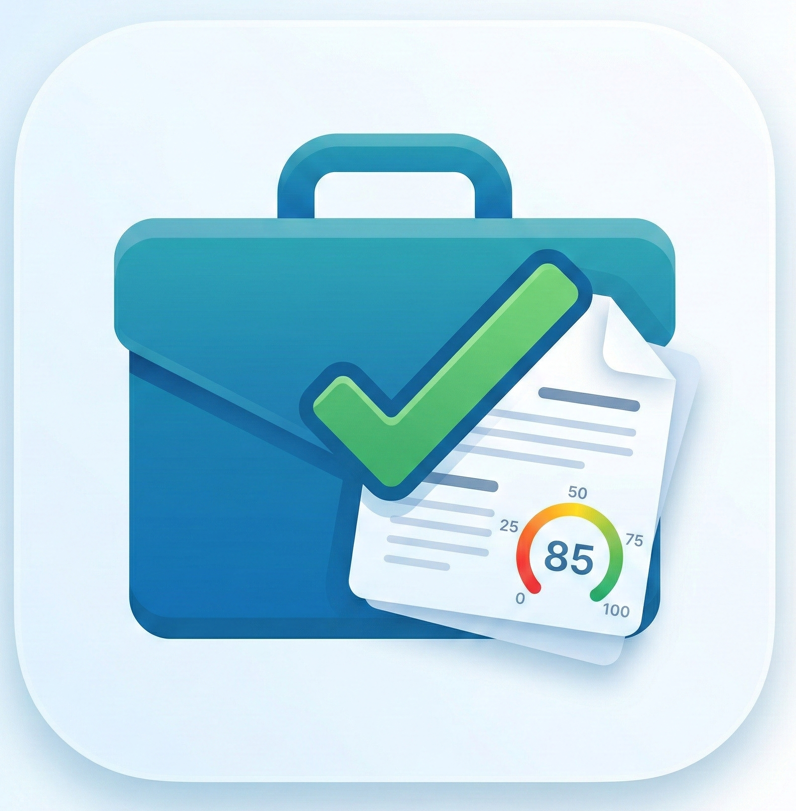

<p align="center">
  
</p>

> **Adapta tu CV a cualquier oferta de trabajo con IA local  100% privado, 100% tuyo.**

[](https://python.org)
[](https://gradio.app)
[](https://lmstudio.ai)
[](LICENSE)

---

## ¿Qué hace?

JobFit Agent analiza una oferta de trabajo y tu CV, y en segundos entrega:

| Entregable | Descripción |
|---|---|
| **A · Diagnóstico de encaje** | Score 0 a 100 + fortalezas y gaps vs. la oferta |
| **B · Keywords ATS** | Clasificadas: presentes , débiles  o ausentes  |
| **C · Plan de cambios** | Lista priorizada: alto / medio / opcional |
| **D · CV reescrito** | CV completo listo para enviar  descargable en `.txt` y `.docx` |
| **E · Variantes Resumen + Skills** | Versión ATS-first y versión Recruiter-first |
| **F · Checklist ATS final** | 1215 puntos de validación antes de enviar |

> Todo el procesamiento ocurre en tu máquina. Ningún dato sale al exterior.

---

##  Inicio rápido

```bash
# 1. Preparar entorno
python -m venv venv
venv\Scripts\activate
pip install -r requirements.txt

# 2. Arrancar
python main.py
#  Abre http://localhost:7860
```

O con doble clic en Windows:

```
start_jobfit.bat
```

---

##  Configuración de LM Studio

Sin LM Studio, la app funciona en **modo básico** (reglas). Con LM Studio activo se generan los 6 entregables con calidad profesional.

1. Descarga desde [lmstudio.ai](https://lmstudio.ai)
2. Carga un modelo (Llama 3, Mistral, Qwen)
3. **Local Server**  **Start Server** (puerto `1234`)
4. Vuelve a JobFit  detecta la conexión automáticamente

---

##  Estructura del proyecto

```
JobFit_1/
 main.py                  # Punto de entrada
 start_jobfit.bat         # Launcher Windows (1 clic)
 dev_tools.bat            # Panel de desarrollador
 requirements.txt

 src/
    llm/                 # Cliente LM Studio
    extractor/           # Parsers CV y ofertas (PDF / DOCX / TXT)
    auditor/             # Scoring de realismo de ofertas
    matcher/             # Matching semántico (Sentence Transformers)
    generator/           # Adaptador CV + analizador ATS completo
    scraper/             # Extracción desde URLs de empleo

 interface/               # Interfaz web Gradio
 config/                  # Settings y prompts del LLM
 data/                    # Templates y archivos temporales
 exports/                 # CVs generados
 tests/                   # Suite de tests
 scripts/                 # Utilidades (check_env, log_viewer)
 docs/                    # Documentación técnica
 logs/                    # Logs de la aplicación
```

---

##  Cómo se usa

### 1 · Análisis ATS completo

1. Abre `http://localhost:7860`
2. Sube tu CV (PDF, DOCX o TXT)
3. Pega la URL o el texto de la oferta
4. Ajusta idioma, longitud y nivel si quieres
5. Pulsa **Analizar**  obtienes los 6 entregables al instante
6. Descarga el CV reescrito en `.txt` o `.docx`

El CV generado:
- Respeta **100% tu experiencia real** (sin inventar nada)
- Usa títulos de sección correctos, no genéricos
- No incluye notas, preguntas ni comentarios del sistema
- Está listo para enviar directamente a la empresa

### 2 · Auditoría de ofertas

Pega solo la oferta para obtener un score de realismo 0100 con detección de:
- Contradicciones seniority vs. salario
- Requisitos imposibles o indefinidos
- Stack tecnológico incoherente

### 3 · Matching CV  Oferta

Compara semánticamente tu perfil con los requisitos de la posición:
- Algoritmo: `all-MiniLM-L6-v2` (Sentence Transformers)
- Detecta similitud real, no solo palabras exactas
- Identifica qué requisitos cubres y cuáles son tus gaps

---

##  Herramientas de desarrollo

```bash
dev_tools.bat                            # Menú: tests, deps, estado, reset venv
python -m pytest tests/                  # Todos los tests
python scripts/log_viewer.py             # Logs en tiempo real
python scripts/check_env.py              # Verificar entorno
```

---

##  Variables de entorno (`.env`)

```env
LOG_LEVEL=INFO
MAX_CV_SIZE_MB=10
SCRAPING_TIMEOUT=30
USER_AGENT="JobFit Agent 1.0"
```

---

##  Privacidad

- **Sin APIs externas**  toda la IA corre localmente con LM Studio
- **Sin almacenamiento permanente**  CVs procesados en memoria y temporales
- **Logs locales**  solo información técnica, nunca contenido de CVs

---

## 📄 Licencia

Este proyecto está bajo la licencia [MIT](LICENSE).

---

## 🤝 Contribuciones

¡Contribuciones, issues y sugerencias son bienvenidas!  
No dudes en abrir un issue o un pull request.

---

## 📬 Contacto

Para dudas o sugerencias, abre un issue o contacta a través de [Skorpion02](https://github.com/Skorpion02).

---

##  Agradecimientos

- [LM Studio](https://lmstudio.ai)  runtime de IA local
- [Hugging Face](https://huggingface.co)  modelos de embeddings
- [Gradio](https://gradio.app)  interfaz web

---

⭐️ **Si te gustó este proyecto, ¡déjale una estrella!**

---

<p align="center">
  
</p>

<div align="center">
  <b>Hecho con ❤️ por Skorpion02</b>
</div>
