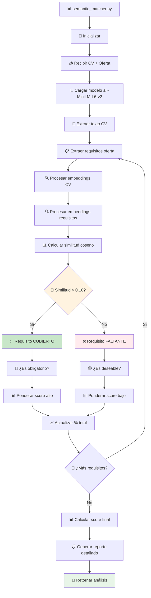
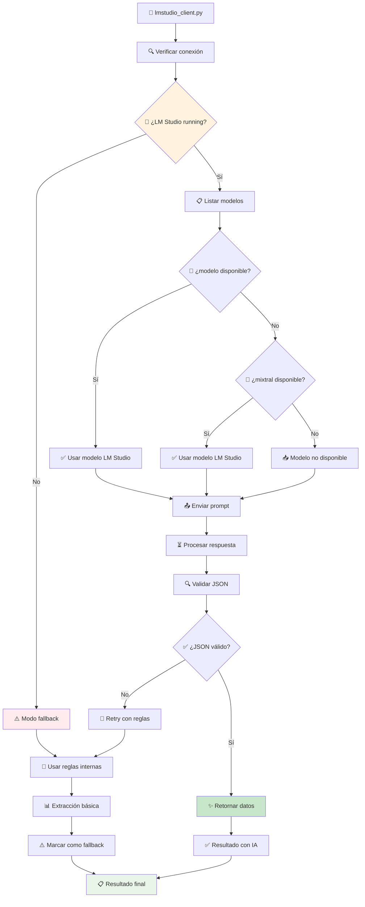
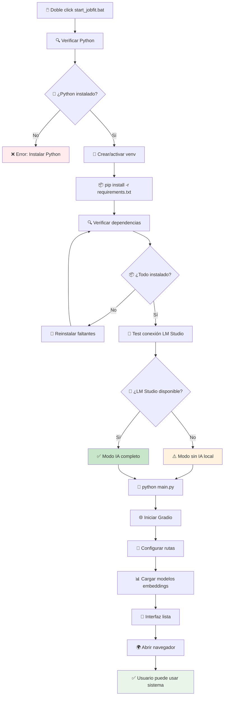
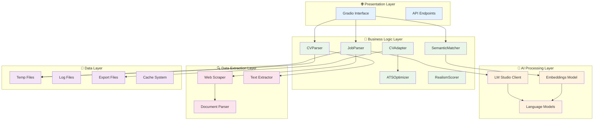
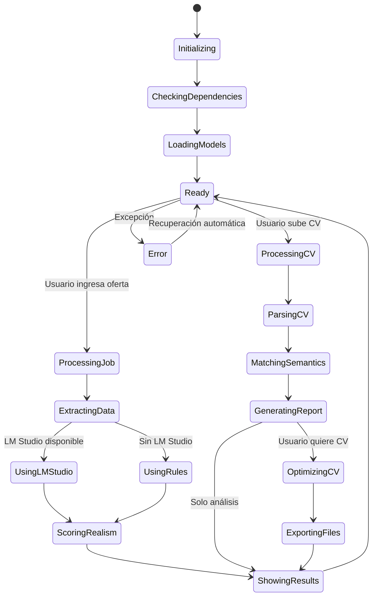
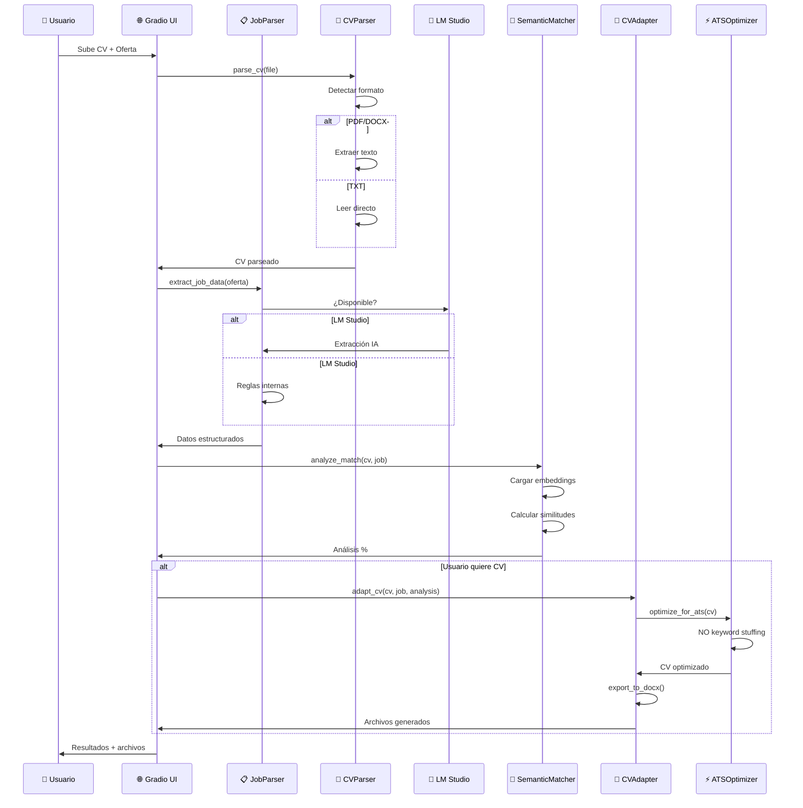
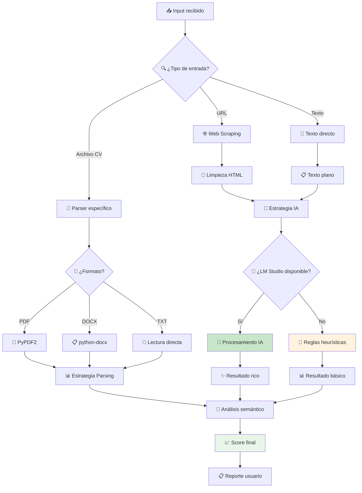

# 🏗️ Arquitectura del Sistema - JobFit Agent

Esta documentación describe la arquitectura técnica del sistema JobFit Agent.

## 📊 Visión General

JobFit Agent está diseñado como un sistema modular con arquitectura en capas que prioriza la **privacidad** y **autonomía** mediante procesamiento local.

```
┌─────────────────────────────────────────────────────────────┐
│                    🌐 CAPA DE PRESENTACIÓN                  │
│                     (Gradio Interface)                     │
└─────────────────────────────────────────────────────────────┘
                                │
┌─────────────────────────────────────────────────────────────┐
│                    🎯 CAPA DE LÓGICA DE NEGOCIO            │
│          (JobParser, CVAdapter, RealismScorer)             │
└─────────────────────────────────────────────────────────────┘
                                │
┌─────────────────────────────────────────────────────────────┐
│                    🤖 CAPA DE IA LOCAL                     │
│                  (LM Studio + Embeddings)                     │
└─────────────────────────────────────────────────────────────┘
                                │
┌─────────────────────────────────────────────────────────────┐
│                    💾 CAPA DE DATOS                        │
│               (Archivos, Cache, Logs)                      │
└─────────────────────────────────────────────────────────────┘
```

## 🔄 Diagrama de Flujo Completo del Agente

### 🚀 Flujo Principal: Análisis Completo CV + Oferta

```mermaid
graph TD
    %% Inicio del sistema
    A[🚀 Usuario inicia JobFit] --> B[🔧 start_jobfit.bat]
    B --> C[⚙️ Activar venv]
    C --> D[📦 Instalar dependencias]
    D --> E[🤖 Verificar LM Studio]
    E --> F[🌐 Iniciar Gradio UI]
    F --> G[👤 Usuario en http://localhost:7860]
    
    %% Entrada de datos
    G --> H{📄 ¿Qué quiere hacer?}
    H -->|Analizar Oferta| I[🔍 Auditoría de Oferta]
    H -->|Adaptar CV| J[📊 Proceso Matching]
    
    %% Flujo Auditoría de Oferta
    I --> K[📝 Usuario ingresa URL/texto]
    K --> L[🌐 job_scraper.py]
    L --> M{🔗 ¿Es URL?}
    M -->|Sí| N[🔍 Extraer HTML]
    M -->|No| O[📝 Usar texto directo]
    N --> P[🧹 Limpiar contenido]
    O --> P
    P --> Q[📋 job_parser.py]
    Q --> R{🤖 ¿LM Studio disponible?}
    R -->|Sí| S[🧠 lmstudio_client.py]
    R -->|No| T[📏 Reglas internas]
    S --> U[✨ Extracción con IA]
    T --> V[🔧 Extracción con patrones]
    U --> W[📊 realism_scorer.py]
    V --> W
    W --> X[🎯 Calcular score 0-100]
    X --> Y[📈 Mostrar análisis detallado]
    Y --> Z[✅ Usuario ve resultado]
    
    %% Flujo Matching CV-Oferta
    J --> AA[📄 Usuario sube CV]
    AA --> BB{📁 ¿Formato válido?}
    BB -->|No| CC[❌ Error formato]
    BB -->|Sí| DD[📖 cv_parser.py]
    DD --> EE{📄 ¿Tipo archivo?}
    EE -->|PDF| FF[📑 Extraer con PyPDF2]
    EE -->|DOCX| GG[📋 Extraer con python-docx]
    EE -->|TXT| HH[📝 Leer texto plano]
    FF --> II[🧹 Limpiar texto CV]
    GG --> II
    HH --> II
    II --> JJ[📝 Usuario ingresa oferta]
    JJ --> KK[📋 job_parser.py]
    KK --> LL{🤖 ¿LM Studio disponible?}
    LL -->|Sí| MM[🧠 Extracción IA]
    LL -->|No| NN[📏 Extracción reglas]
    MM --> OO[🎯 semantic_matcher.py]
    NN --> OO
    OO --> PP[📊 Cargar modelo embeddings]
    PP --> QQ[🔍 Analizar similitud semántica]
    QQ --> RR[📈 Calcular % compatibilidad]
    RR --> SS[📋 Identificar requisitos]
    SS --> TT{✅ ¿Generar CV adaptado?}
    TT -->|No| UU[📊 Solo mostrar análisis]
    TT -->|Sí| VV[📝 cv_adapter.py]
    VV --> WW[🎨 ats_optimizer.py]
    WW --> XX[🚫 NO agregar keywords fake]
    XX --> YY[✨ Optimización natural]
    YY --> ZZ[📄 Generar TXT limpio]
    ZZ --> AAA[📋 export_to_docx()]
    AAA --> BBB[🎨 Formato profesional]
    BBB --> CCC[🚫 Eliminar emojis]
    CCC --> DDD[💾 Guardar en exports/]
    DDD --> EEE[⬇️ Descarga automática]
    UU --> FFF[📊 Mostrar resultados]
    EEE --> FFF
    FFF --> GGG[✅ Usuario ve análisis completo]
    
    %% Gestión de errores
    CC --> HHH[📝 Mostrar error]
    HHH --> G
    
    %% Logging y monitoreo
    Z --> III[📝 Log resultado]
    GGG --> III
    III --> JJJ[💾 logs/jobfit.log]
    
    style A fill:#e1f5fe
    style F fill:#c8e6c9
    style Z fill:#fff3e0
    style GGG fill:#fff3e0
    style CC fill:#ffebee
    style III fill:#f3e5f5
```

### 🔍 Flujo Detallado: Análisis Semántico



### 🤖 Flujo IA Local: LM Studio Integration



### 📄 Flujo Generación CV: ATS Optimizer

```mermaid
graph TD
    A[📝 cv_adapter.py] --> B[📊 Recibir análisis matching]
    B --> C[🎯 ats_optimizer.py]
    C --> D[🚫 NO keyword stuffing]
    D --> E[📄 Preservar CV original]
    E --> F[✨ Optimización natural]
    F --> G[🧹 Limpiar formato]
    G --> H[📝 Generar TXT limpio]
    H --> I[📋 export_to_docx()]
    I --> J[🎨 Aplicar formato corporativo]
    J --> K[🚫 Eliminar emojis contacto]
    K --> L[📊 Estructurar secciones]
    L --> M[💾 Guardar archivo DOCX]
    M --> N[⬇️ Preparar descarga]
    N --> O[✅ CV profesional listo]
    
    %% Anti-patterns evitados
    P[❌ Agregar competencias fake] 
    Q[❌ Keyword stuffing]
    R[❌ Modificar experiencia]
    
    D -.-> P
    D -.-> Q
    D -.-> R
    
    style D fill:#c8e6c9
    style O fill:#e8f5e8
    style P fill:#ffebee
    style Q fill:#ffebee
    style R fill:#ffebee
```

### 🔧 Flujo Inicialización Sistema



## 🧩 Componentes Principales

### 📊 Diagrama de Componentes del Sistema



### 🔄 Estados del Sistema



### 1. 🌐 Interface Layer (`interface/`)

#### `gradio_app.py`
- **Responsabilidad**: Interfaz web del usuario
- **Tecnología**: Gradio 4.4.0
- **Funciones clave**:
  - `audit_job_offer()`: Procesa auditoría de ofertas
  - `process_cv_and_match()`: Maneja matching CV-oferta
  - `_get_status_message()`: Estado del sistema en tiempo real

**Flujo de interacción**:
```
Usuario → Gradio UI → JobFitApp → Componentes Backend → Respuesta
```

### 2. 🔍 Extraction Layer (`src/extractor/`)

#### `job_parser.py`
- **Responsabilidad**: Extracción estructurada de ofertas de trabajo
- **Patrón**: Strategy Pattern (LM Studio → Rules fallback)
- **Métodos principales**:
  - `extract_job_data()`: Punto de entrada principal
  - `_extract_with_lm()`: Procesamiento con IA local
  - `_extract_with_rules()`: Fallback basado en reglas

#### `cv_parser.py`
- **Responsabilidad**: Procesamiento de CVs (PDF/DOCX)
- **Tecnología**: PyPDF2, python-docx, unstructured
- **Funciones**:
  - Extracción de texto limpio
  - Identificación de secciones
  - Normalización de formato

### 3. 🤖 AI Processing Layer (`src/llm/`)

#### `lmstudio_client.py`
- **Responsabilidad**: Cliente para IA local
- **Tecnología**: LM Studio (OpenAI-compatible local API)
- **Características**:
  - Detección automática de modelos
  - Fallback graceful si no disponible
  - Parsing robusto de respuestas JSON

**Modelos soportados**:
- **llama3**: Modelo principal (rápido, preciso)
- **mixtral**: Alternativo (más capacidad)
- **Autodetección**: Usa el primer modelo disponible

### 4. 🎯 Matching Layer (`src/matcher/`)

#### `semantic_matcher.py`
- **Responsabilidad**: Matching semántico CV-oferta
- **Tecnología**: Sentence Transformers
- **Algoritmo**:
  ```
  1. Embeddings de CV y oferta
  2. Similitud coseno por secciones
  3. Ponderación por importancia
  4. Score final 0-100
  ```

### 5. 📊 Auditing Layer (`src/auditor/`)

#### `realism_scorer.py`
- **Responsabilidad**: Evalúa realismo de ofertas
- **Métricas**:
  - **Años vs Seniority**: Coherencia experiencia-nivel
  - **Stack Tecnológico**: Realismo de requisitos técnicos
  - **Salario**: Coherencia con mercado
  - **Contradicciones**: Detección de inconsistencias

**Algoritmo de scoring**:
```python
score_final = 100 - (penalización_años + penalización_stack + 
                     penalización_salario + penalización_contradicciones)
```

### 6. 📝 Generation Layer (`src/generator/`)

#### `cv_adapter.py`
- **Responsabilidad**: Adaptación profesional de CV
- **Principio**: **No inventar información** - solo reorganizar
- **Proceso**:
  1. Análisis de matching semántico
  2. Priorización de experiencias relevantes
  3. Optimización de palabras clave
  4. Generación DOCX con formato corporativo

### 7. 🌐 Scraping Layer (`src/scraper/`)

#### `job_scraper.py`
- **Responsabilidad**: Extracción de ofertas desde URLs
- **Tecnología**: BeautifulSoup4, Selenium (fallback)
- **Sitios soportados**:
  - InfoJobs
  - LinkedIn Jobs
  - Generic HTML scraping

## 🔄 Flujos de Datos Detallados

### 📊 Flujo de Datos: Procesamiento Completo



### 🎯 Flujo de Decisiones: Estrategia de Procesamiento



## 🛡️ Patrones de Diseño

### 1. **Strategy Pattern** - Procesamiento de IA
```python
class JobParser:
    def extract_job_data(self, text):
        if lmstudio_available():
            return self._extract_with_lm(text)
        else:
            return self._extract_with_rules(text)
```

### 2. **Factory Pattern** - Creación de componentes
```python
def create_parser(use_lm=True):
    if use_lm and lmstudio_client.available:
        return LMStudioJobParser()
    return RulesJobParser()
```

### 3. **Observer Pattern** - Logging y monitoreo
```python
class JobFitApp:
    def __init__(self):
        self.logger = logging.getLogger(__name__)
        # Auto-notificación de eventos
```

### 4. **Decorator Pattern** - Caching y validación
```python
@validate_input
@cache_result
def extract_job_data(self, text):
    # Lógica de extracción
```

## 🔧 Configuración y Dependencias

### Inyección de Dependencias
```python
# config/settings.py
class Settings:
    lmstudio_base_url: str = "http://127.0.0.1:1234"
    lmstudio_model: str = "auto"
    use_lmstudio: bool = True
```

### Gestión de Estado
- **Stateless**: Cada request es independiente
- **Cache temporal**: Solo para performance, no para persistencia
- **Session management**: Via Gradio interface state

## 📊 Performance y Escalabilidad

### Métricas de Performance

| Componente | Tiempo Promedio | Memoria Peak | Notas |
|------------|----------------|--------------|-------|
| LM Studio Extraction | 3-8s | 500MB | Depende del modelo |
| Rules Extraction | 50-200ms | 50MB | Muy rápido |
| CV Parsing | 100-500ms | 100MB | Depende del tamaño |
| Semantic Matching | 200-800ms | 200MB | Carga modelo embeddings |
| PDF Generation | 300-600ms | 80MB | I/O intensivo |

### Optimizaciones Implementadas

1. **Lazy Loading**: Modelos solo se cargan cuando se necesitan
2. **Connection Pooling**: Reutilización de conexiones HTTP
3. **Memory Management**: Liberación explícita de recursos
4. **Async Operations**: Operaciones no bloqueantes donde es posible

### Escalabilidad Horizontal

Para escalar el sistema:

1. **Containerización**:
   ```dockerfile
   FROM python:3.11-slim
   COPY requirements.txt .
   RUN pip install -r requirements.txt
   COPY . .
   CMD ["python", "main.py"]
   ```

2. **Load Balancing**: Multiple instancias detrás de nginx
3. **Microservicios**: Separar componentes en servicios independientes
4. **GPU Acceleration**: Para modelos LM Studio en producción

## 🔒 Seguridad y Privacidad

### Principios de Seguridad

1. **Data Minimization**: Solo procesar datos necesarios
2. **Local Processing**: No envío de datos a servicios externos
3. **Temporary Storage**: Archivos temporales se eliminan automáticamente
4. **Input Validation**: Sanitización de todas las entradas

### Manejo de Datos Sensibles

```python
# Ejemplo de limpieza automática
class TemporaryFileManager:
    def __enter__(self):
        self.temp_file = create_temp_file()
        return self.temp_file
    
    def __exit__(self, exc_type, exc_val, exc_tb):
        os.remove(self.temp_file)  # Limpieza garantizada
```

### Logs y Auditoría

- **No logging de datos personales**: Solo eventos técnicos
- **Rotation automática**: Previene acumulación de logs
- **Levels apropiados**: DEBUG, INFO, WARNING, ERROR

## 🚀 Futuras Mejoras Arquitecturales

### Roadmap Técnico

#### v2.0 - Microservicios
- Separar componentes en servicios independientes
- API REST para cada componente
- Message queues para comunicación asíncrona

#### v2.1 - Performance
- GPU acceleration para embeddings
- Distributed caching con Redis
- Database backend opcional

#### v3.0 - Enterprise
- Multi-tenancy support
- RBAC (Role-Based Access Control)
- Audit trails completos
- High availability setup

### Consideraciones de Migración

1. **Backwards compatibility**: Mantener APIs existentes
2. **Database migration**: Scripts automáticos de migración
3. **Configuration management**: Centralizado con validación
4. **Testing strategy**: Tests de integración robustos