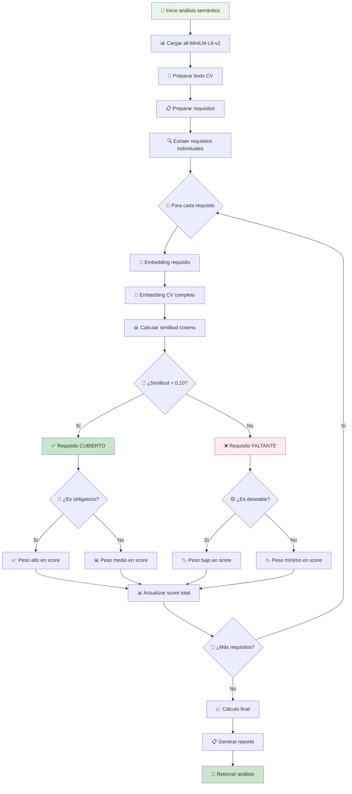
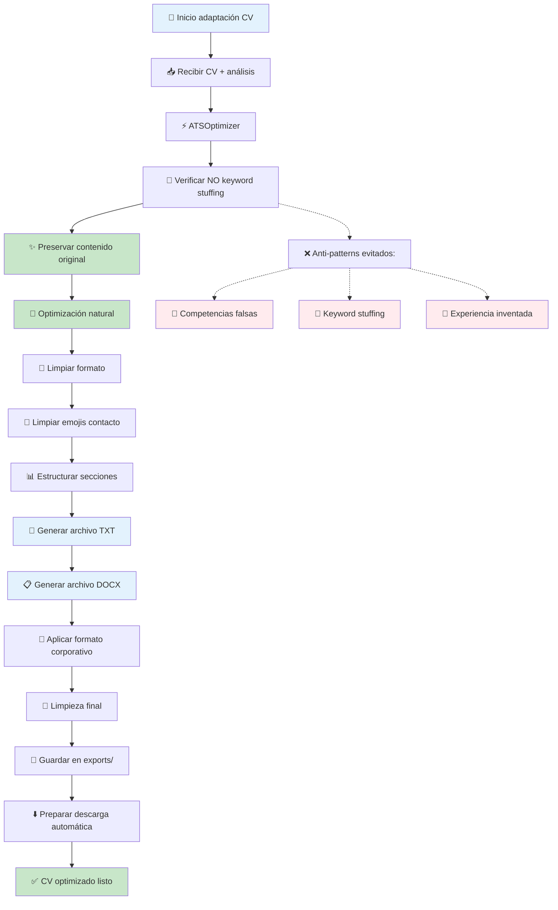
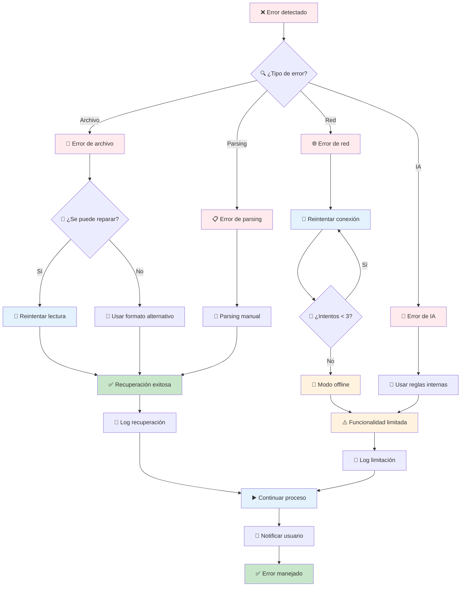
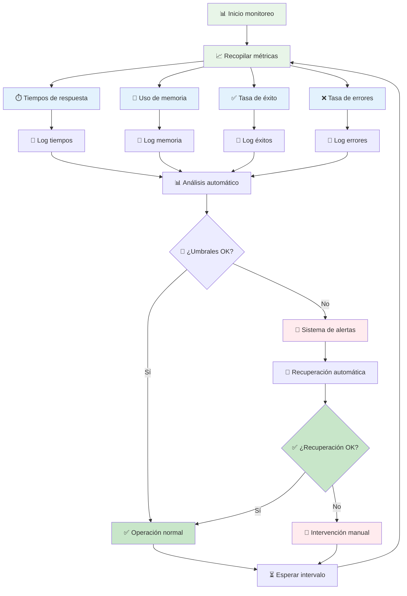
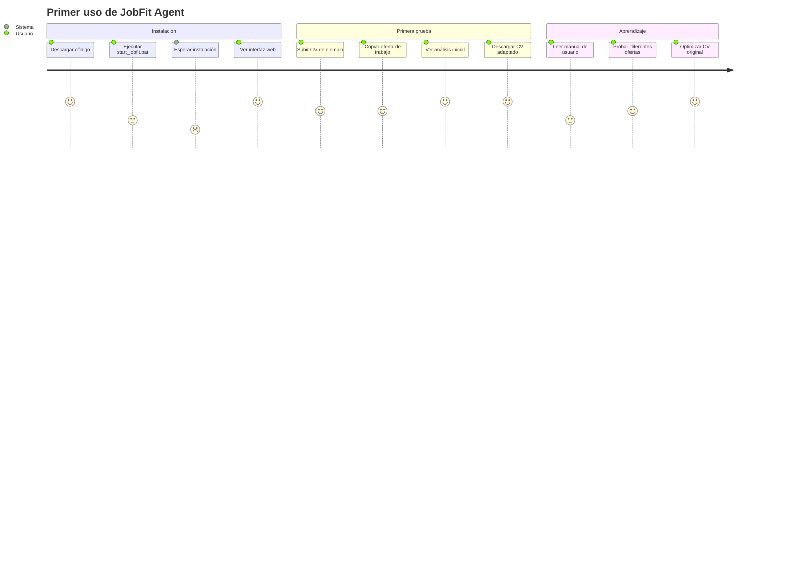
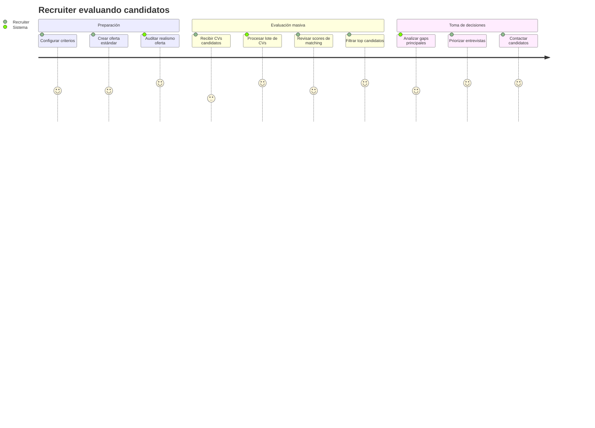

# 🔄 Diagrama de Flujo Completo - JobFit Agent

Este documento contiene el diagrama de flujo detallado y completo del agente JobFit, mostrando todos los procesos, decisiones y componentes del sistema.

---

## 🎯 Flujo Principal del Agente

### 🚀 Vista General del Sistema

```mermaid
graph TB
    %% Inicio del sistema
    START([🚀 Inicio JobFit Agent]) --> LAUNCHER[🔧 start_jobfit.bat]
    LAUNCHER --> VENV[⚙️ Activar entorno virtual]
    VENV --> DEPS[📦 Instalar dependencias]
    DEPS --> UI_START[🌐 Iniciar Gradio UI]
    UI_START --> READY[✅ Sistema listo - Puerto 7860]
    
    %% Entrada del usuario
    READY --> USER_INPUT{👤 ¿Qué hace el usuario?}
    
    %% Opción 1: Solo auditar oferta
    USER_INPUT -->|📊 Auditar Oferta| AUDIT_FLOW[🔍 Flujo de Auditoría]
    
    %% Opción 2: Matching completo
    USER_INPUT -->|🎯 Adaptar CV| MATCH_FLOW[📊 Flujo de Matching]
    
    %% Flujo de Auditoría
    AUDIT_FLOW --> INPUT_JOB[📝 Ingresar oferta]
    INPUT_JOB --> JOB_TYPE{🔗 ¿Tipo de entrada?}
    
    JOB_TYPE -->|URL| SCRAPE[🌐 Web Scraping]
    JOB_TYPE -->|Texto| DIRECT_TEXT[📝 Procesamiento directo]
    
    SCRAPE --> CLEAN_HTML[🧹 Limpiar HTML]
    DIRECT_TEXT --> PARSE_JOB[📋 Parsear oferta]
    CLEAN_HTML --> PARSE_JOB
    
    PARSE_JOB --> AI_CHECK{🤖 ¿LM Studio disponible?}
    AI_CHECK -->|Sí| AI_EXTRACT[🧠 Extracción con IA]
    AI_CHECK -->|No| RULES_EXTRACT[📏 Extracción con reglas]
    
    AI_EXTRACT --> SCORE_REALISM[📊 Scoring de realismo]
    RULES_EXTRACT --> SCORE_REALISM
    
    SCORE_REALISM --> AUDIT_RESULT[📈 Mostrar resultado auditoría]
    AUDIT_RESULT --> END_AUDIT[✅ Fin auditoría]
    
    %% Flujo de Matching
    MATCH_FLOW --> UPLOAD_CV[📄 Subir CV]
    UPLOAD_CV --> CV_FORMAT{📁 ¿Formato CV?}
    
    CV_FORMAT -->|PDF| PDF_PARSE[📑 Parsear PDF]
    CV_FORMAT -->|DOCX| DOCX_PARSE[📋 Parsear DOCX]
    CV_FORMAT -->|TXT| TXT_PARSE[📝 Parsear TXT]
    
    PDF_PARSE --> CV_CLEAN[🧹 Limpiar texto CV]
    DOCX_PARSE --> CV_CLEAN
    TXT_PARSE --> CV_CLEAN
    
    CV_CLEAN --> JOB_INPUT[📝 Ingresar oferta trabajo]
    JOB_INPUT --> PARSE_JOB_MATCH[📋 Parsear oferta]
    
    PARSE_JOB_MATCH --> AI_CHECK2{🤖 ¿LM Studio disponible?}
    AI_CHECK2 -->|Sí| AI_EXTRACT2[🧠 Extracción IA]
    AI_CHECK2 -->|No| RULES_EXTRACT2[📏 Extracción reglas]
    
    AI_EXTRACT2 --> SEMANTIC_MATCH[🎯 Análisis semántico]
    RULES_EXTRACT2 --> SEMANTIC_MATCH
    
    SEMANTIC_MATCH --> LOAD_EMBEDDINGS[📊 Cargar modelo embeddings]
    LOAD_EMBEDDINGS --> CALCULATE_SIM[🔍 Calcular similitud]
    CALCULATE_SIM --> MATCH_SCORE[📈 Score de matching]
    
    MATCH_SCORE --> SHOW_ANALYSIS[📊 Mostrar análisis]
    SHOW_ANALYSIS --> USER_CHOICE{👤 ¿Generar CV adaptado?}
    
    USER_CHOICE -->|No| ANALYSIS_ONLY[📊 Solo mostrar análisis]
    USER_CHOICE -->|Sí| ADAPT_CV[📝 Adaptar CV]
    
    %% Adaptación de CV
    ADAPT_CV --> ATS_OPT[⚡ Optimizador ATS]
    ATS_OPT --> NO_STUFF[🚫 NO keyword stuffing]
    NO_STUFF --> PRESERVE_ORIG[✨ Preservar contenido original]
    PRESERVE_ORIG --> CLEAN_FORMAT[🧹 Formato limpio]
    CLEAN_FORMAT --> GENERATE_TXT[📝 Generar TXT]
    GENERATE_TXT --> GENERATE_DOCX[📋 Generar DOCX]
    GENERATE_DOCX --> REMOVE_EMOJIS[🚫 Eliminar emojis]
    REMOVE_EMOJIS --> SAVE_FILES[💾 Guardar archivos]
    SAVE_FILES --> AUTO_DOWNLOAD[⬇️ Descarga automática]
    
    ANALYSIS_ONLY --> FINAL_RESULT[📈 Resultado final]
    AUTO_DOWNLOAD --> FINAL_RESULT
    
    FINAL_RESULT --> LOG_ACTIVITY[📝 Log actividad]
    LOG_ACTIVITY --> END_PROCESS[✅ Proceso completado]
    END_AUDIT --> END_PROCESS
    
    END_PROCESS --> READY
    
    %% Estilos
    classDef startEnd fill:#e8f5e8,stroke:#4caf50,stroke-width:3px
    classDef process fill:#e3f2fd,stroke:#2196f3,stroke-width:2px
    classDef decision fill:#fff3e0,stroke:#ff9800,stroke-width:2px
    classDef ai fill:#f3e5f5,stroke:#9c27b0,stroke-width:2px
    classDef error fill:#ffebee,stroke:#f44336,stroke-width:2px
    classDef success fill:#e8f5e8,stroke:#4caf50,stroke-width:2px
    
    class START,READY,END_PROCESS startEnd
    class LAUNCHER,VENV,DEPS,UI_START,UPLOAD_CV,CV_CLEAN,ADAPT_CV process
    class USER_INPUT,JOB_TYPE,CV_FORMAT,AI_CHECK,AI_CHECK2,USER_CHOICE decision
    class AI_EXTRACT,AI_EXTRACT2,SEMANTIC_MATCH ai
    class FINAL_RESULT,AUTO_DOWNLOAD success
```



---

## 🔍 Flujo Detallado por Componente

### 📊 1. Análisis Semántico Detallado



### 🤖 2. Integración LM Studio Detallada

```mermaid
graph TD
    LM_START[🤖 Inicio LM Studio Client] --> CHECK_CONN[🔍 Verificar conexión]
    CHECK_CONN --> PING_SERVER{🏓 ¿Servidor responde?}
    
    PING_SERVER -->|No| FALLBACK_MODE[⚠️ Activar modo fallback]
    PING_SERVER -->|Sí| LIST_MODELS[📋 Listar modelos disponibles]
    
    LIST_MODELS --> MODEL_CHECK{🧠 Conectar al servidor}
    MODEL_CHECK -->|Sí| USE_LLAMA3[✅ Usando LM Studio]
    MODEL_CHECK -->|Sí| USE_MIXTRAL[✅ Usando LM Studio]
    MODEL_CHECK -->|No| INSTALL_MODEL[📥 Modelo no disponible]
    
    USE_LLAMA3 --> SEND_PROMPT[📤 Enviar prompt]
    USE_MIXTRAL --> SEND_PROMPT
    INSTALL_MODEL --> SEND_PROMPT
    
    SEND_PROMPT --> WAIT_RESPONSE[⏳ Esperar respuesta]
    WAIT_RESPONSE --> PARSE_JSON[🔍 Parsear JSON]
    
    PARSE_JSON --> VALID_JSON{✅ ¿JSON válido?}
    VALID_JSON -->|No| RETRY_PARSE[🔄 Reintentar parsing]
    VALID_JSON -->|Sí| EXTRACT_DATA[📊 Extraer datos]
    
    RETRY_PARSE --> RETRY_COUNT{🔢 ¿Intentos < 3?}
    RETRY_COUNT -->|Sí| PARSE_JSON
    RETRY_COUNT -->|No| FALLBACK_PARSE[📏 Usar fallback]
    
    EXTRACT_DATA --> VALIDATE_DATA[✅ Validar datos]
    VALIDATE_DATA --> RETURN_AI[🧠 Retornar resultado IA]
    
    FALLBACK_MODE --> RULES_ENGINE[📏 Motor de reglas]
    FALLBACK_PARSE --> RULES_ENGINE
    RULES_ENGINE --> BASIC_EXTRACT[📊 Extracción básica]
    BASIC_EXTRACT --> RETURN_FALLBACK[⚠️ Retornar resultado básico]
    
    %% Estilos
    classDef ai fill:#f3e5f5
    classDef success fill:#c8e6c9
    classDef warning fill:#fff3e0
    classDef error fill:#ffebee
    
    class LM_START,USE_LM USE_LM,USE_LM_FALLBACK ai
    class RETURN_AI success
    class FALLBACK_MODE,RETURN_FALLBACK warning
    class RETRY_PARSE error
```

### 📝 3. Generación de CV Optimizado



---

## 🔧 Flujos de Error y Recuperación

### ⚠️ Gestión de Errores del Sistema



---

## 📊 Métricas y Monitoring

### 📈 Flujo de Monitoreo del Sistema



---

## 🎯 Casos de Uso Específicos

### 👤 Caso 1: Usuario Nuevo



### 🏢 Caso 2: Recruiter Profesional



---

<div align="center">

**🎯 Diagrama Completo del Agente JobFit**

*Sistema inteligente de matching CV-Trabajo con IA local*

📚 [Manual de Usuario](manual_usuario.md) | 🏗️ [Arquitectura](architecture.md) | 🧪 [Testing](testing_guide.md)

</div>